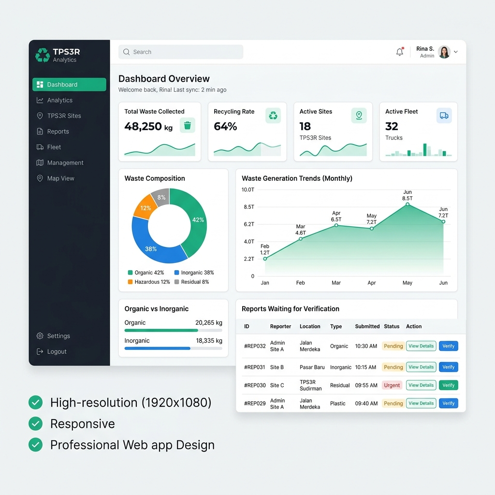
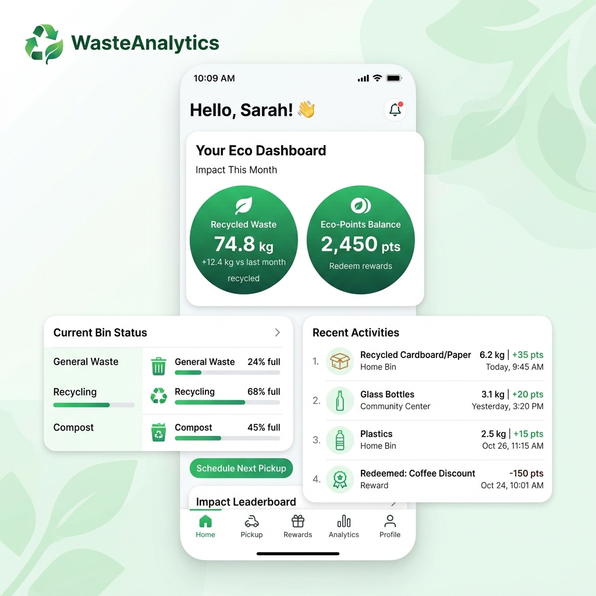

# TPS3R - Smart Waste Management Platform

Platform pengelolaan sampah digital modern terintegrasi yang dirancang untuk mendukung TPS 3R (Reduce, Reuse, Recycle) dalam mengelola, mencatat, memverifikasi, dan menganalisis sampah secara real-time.

---

## 📷 Preview Tampilan Aplikasi

### 1. Web Admin Panel Dashboard (Vite + React)
Dashboard modern bagi admin untuk memantau aktivitas transaksi sampah, verifikasi bukti laporan dari member, dan mengelola data tim secara terpusat.



### 2. Mobile Member Application (Flutter)
Aplikasi seluler bagi member/komunitas untuk melaporkan tumpukan sampah, memantau riwayat laporan, melihat akumulasi poin daur ulang, serta membaca edukasi kebersihan.



---

## 📂 Struktur Project

Project ini terbagi menjadi 3 komponen utama:

1. **`tps3r-backend`**: Core API & Engine utama berbasis Laravel 10.
2. **`tps3r-admin`**: Panel dashboard admin berbasis React (TypeScript) + Vite + Material UI.
3. **`tps3r-mobile`**: Aplikasi mobile member berbasis Flutter (Dart) yang kompatibel lintas platform (Web, Android, iOS).
4. **`tps3r.sql`**: Dump database awal untuk di-import.

---

## 🚀 Panduan Instalasi & Menjalankan Aplikasi

### Langkah 1: Setup Database (Laragon / XAMPP)
1. Buat database baru di MySQL dengan nama `tps3r`.
2. Import file database `tps3r.sql` yang berada di root folder ke database tersebut.

### Langkah 2: Setup Backend Laravel API (`tps3r-backend`)
1. Buka terminal di folder `tps3r-backend`.
2. Copy `.env.example` menjadi `.env` dan sesuaikan kredensial database:
   ```env
   DB_HOST=127.0.0.1
   DB_PORT=3306
   DB_DATABASE=tps3r
   DB_USERNAME=root
   DB_PASSWORD=
   
   APP_URL=http://127.0.0.1:8000
   ```
3. Jalankan perintah instalasi dependency:
   ```bash
   composer install
   ```
4. **Sangat Penting!** Hubungkan symbolic link storage agar media/gambar dapat diakses dari luar:
   ```bash
   php artisan storage:link
   ```
5. Jalankan server lokal Laravel:
   ```bash
   php artisan serve
   ```
   Laravel API akan berjalan pada alamat `http://127.0.0.1:8000`.

### Langkah 3: Setup Web Admin Panel (`tps3r-admin`)
1. Buka terminal di folder `tps3r-admin`.
2. Jalankan perintah instalasi packages:
   ```bash
   npm install
   ```
3. Jalankan server local development:
   ```bash
   npm run dev
   ```
   Web Admin dapat diakses via browser pada alamat `http://localhost:5173/`.

### Langkah 4: Setup Mobile Member App (`tps3r-mobile`)
1. Buka terminal di folder `tps3r-mobile`.
2. Unduh paket dependency Flutter:
   ```bash
   flutter pub get
   ```
3. Jalankan aplikasi menggunakan target Chrome Web (atau Emulator Android/iOS):
   ```bash
   flutter run -d chrome --web-port=8080
   ```
   Aplikasi mobile client web akan terbuka di alamat `http://localhost:8080/`.

---

## 🔑 Informasi Akun Default

* **Akun Admin Dashboard Web:**
  * **Email:** `admin@tps3r.com`
  * **Password:** `Admin123`

* **Akun Member App:**
  * Anda dapat mendaftarkan akun member baru secara instan langsung melalui menu **Daftar Sekarang** pada aplikasi Flutter.
